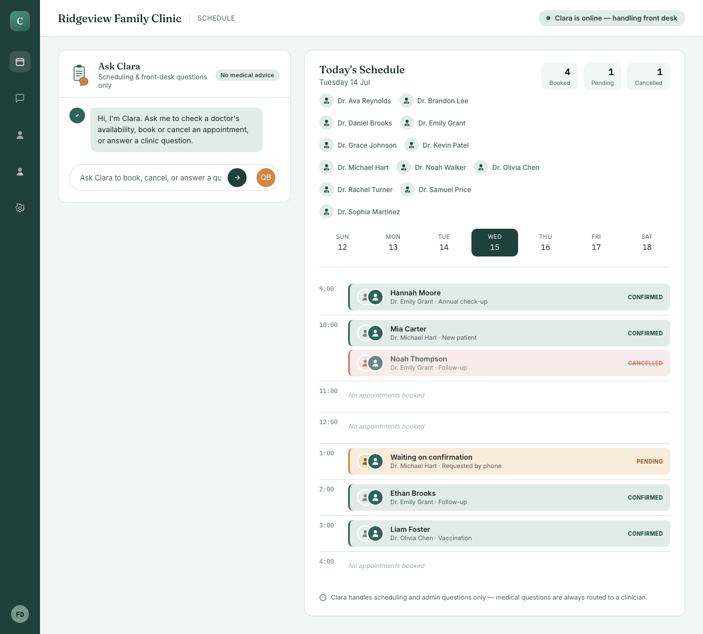

# Clara — Clinic Admin Agent & Dashboard

An AI front-desk agent for Ridgeview Family Clinic: checking doctor
availability, booking and cancelling appointments, and answering common
questions (hours, location, insurance, cancellation policy). Built with the
Anthropic API (Claude) using tool use, backed by a small SQLite database, with
both a CLI and a full web dashboard.

Clara is scoped to clinic administrative workflows only — she does not
diagnose, interpret symptoms, or give medical advice. The system prompt
enforces this and redirects medical questions to a clinician or emergency
services.

## Key features

- Web dashboard (`web.py` + `templates/dashboard.html`) with five pages:
  Schedule (chat console + timeline), Messages (patient threads), Patients,
  Doctors, and Settings
- CLI chat experience via `main.py`
- Appointment booking, cancellation, and availability checking
- FAQ-style clinic support queries
- SQLite-backed persistence in `data/clinic.db`, with a one-command dummy
  data reset (`seed_demo_data.py`)

## Repository structure

```
.
├── .env.example           # example configuration file for API key
├── README.md
├── main.py                # CLI entrypoint
├── web.py                 # Flask web application (dashboard + JSON API)
├── seed_demo_data.py       # reset the DB and reseed it with dummy data
├── requirements.txt
├── data/                   # local SQLite database file
├── src/
│   └── healthagent/
│       ├── __init__.py
│       ├── agent.py        # Claude tool-use orchestration and prompt handling
│       ├── database.py     # SQLite schema, connection, and seed/init logic
│       └── tools.py        # agent tools + dashboard query helpers
├── templates/
│   └── dashboard.html      # Schedule / Messages / Patients / Doctors / Settings UI
└── tests/
    └── test_tools.py       # unit tests for booking and dashboard helper logic
```

## Prerequisites

- Python 3.11+ (recommended)
- `ANTHROPIC_API_KEY`

## Setup

```bash
cd /Users/MuhammadUsman/Documents/GitHub/Health
python -m venv .venv
source .venv/bin/activate
pip install -r requirements.txt
cp .env.example .env
```

Then open `.env` and set:

```env
ANTHROPIC_API_KEY=your-api-key-here
```

## Run the web dashboard

```bash
python web.py
```

Then visit http://127.0.0.1:5000. The dashboard has five pages:

- **Schedule** — an "Ask Clara" chat console (talks to the live agent) next to
  today's appointment timeline, doctor chips, and booked/pending/cancelled
  counts. Click a day in the week strip to view another day.
- **Messages** — patient SMS-style threads. Replying to a thread runs the
  message through Clara, including any booking/cancellation tool calls.
- **Patients** — patient directory with last visit / next appointment /
  insurance / status, computed live from the appointments table.
- **Doctors** — profile cards (bio, experience, rating, patients/week) with an
  availability preview for the current day.
- **Settings** — clinic hours, accepted insurance, cancellation policy, and
  Clara's guardrails.

Voice booking: The dashboard supports a quick voice booking flow on the
Schedule → Quick Book panel. Click the microphone button, speak your booking
request (for example: "Book John Doe with Dr. Emily Grant tomorrow at 9am"),
then confirm the parsed fields and submit. Browser requirements: use a
Chromium-based browser (Chrome/Edge) that supports the Web Speech API. The
app will also read back a concise confirmation using the browser's Text-to-
Speech engine.



This snapshot shows the Schedule page with the Ask Clara console, today's
appointment timeline, doctor availability chips, and the status summary cards
(Booked / Pending / Cancelled). The web app also includes Messages, Patients,
Doctors, and Settings pages for full clinic admin workflows.

Pages that only display data (Patients, Doctors, Settings, the appointment
timeline) work without an API key. The two chat surfaces (Schedule console,
Messages replies) need `ANTHROPIC_API_KEY` and return a clear error if it's
missing.

## Run the CLI (alternative)

```bash
python main.py
```

```
You: What doctors do you have?
Clara: We have Dr. Emily Grant (Family Medicine), Dr. Michael Hart (Cardiology), Dr. Olivia Chen (Pediatrics).

You: Book me with Dr. Emily Grant next Monday at 10am, I'm Jane Doe
Clara: Confirming: Jane Doe with Dr. Emily Grant on 2026-07-13 at 10:00. Shall I book it?
```

## Reset to dummy data

```bash
python seed_demo_data.py
```

Wipes `data/clinic.db` and reseeds it with the same demo doctors, patients,
appointments, and message threads the app ships with — handy after testing
bookings/cancellations through the dashboard.

## Testing

```bash
pytest tests/ -v
```

15 tests cover booking logic (double-booking prevention, invalid times/dates,
cancellation, FAQ lookup) and the dashboard query helpers (patient directory,
doctor profiles, schedule aggregation, message threads, settings). None
require an API key.

## Architecture overview

`src/healthagent/agent.py` defines a set of tools (`list_doctors`,
`check_availability`, `book_appointment`, `cancel_appointment`,
`list_appointments`, `answer_faq`) and hands them to the Claude Messages API.
When the model needs data or needs to perform an action, it emits a
`tool_use` block; `ClinicAgent` executes the matching function from
`tools.py` against the SQLite database in `data/clinic.db`, returns the
result, and loops until Claude produces a final reply. `ClinicAgent.send()`
also returns a `tool_calls` trace (name, input, result) so the dashboard can
render the `→ tool_name(...)` line shown under Clara's chat bubbles.

`web.py` is a thin Flask layer: read-only pages call `tools.py`'s dashboard
helpers directly; the two chat surfaces go through `ClinicAgent`. The
front-desk "Ask Clara" console keeps one in-memory conversation for the life
of the server process; patient message threads are stored in SQLite
(`message_threads` / `thread_messages`) and rehydrated into a fresh
`ClinicAgent` on each reply so Clara has the thread's context.

- `src/healthagent/database.py` manages SQLite persistence and initial seed data.
- `main.py` starts a terminal chat loop.
- `web.py` starts a Flask app and serves `templates/dashboard.html`.

## Deployment

For a production-ready deployment, consider:
- securing environment variables and removing any secrets from source control
- using a production WSGI server such as Gunicorn or uWSGI for `web.py`
- adding authentication and authorization before exposing the app externally
- moving SQLite to a managed database if you need concurrency and durability
- enforcing HTTPS and appropriate security headers

## Notes

- This project is scoped to clinic administrative workflows only.
- Clara is not a diagnostic tool and should not provide clinical advice.
- If you want clinical features (symptom intake, triage), treat that as a
  separate, more carefully reviewed component — do not fold it into this
  admin agent's scope without clinical and compliance review (HIPAA, etc.).
- For production deployment, add authentication, secure API handling, and
  compliance controls.
